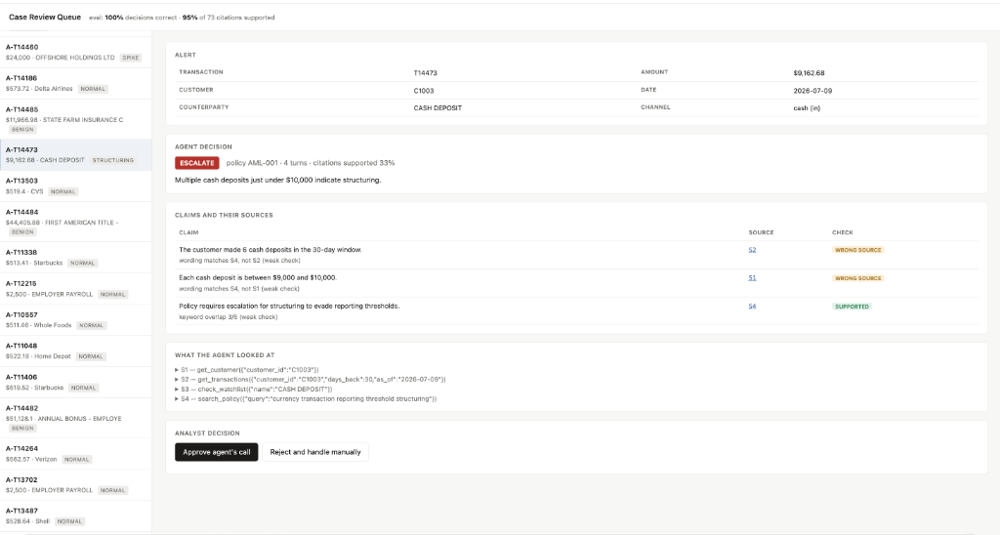

# Case Review Agent



An AI agent that investigates flagged bank transactions, decides whether to escalate
or clear them, and writes up its reasoning — plus an eval harness that checks whether
its reasoning actually matches the records it looked at.

That second part is the point. An agent can reach the right decision for a reason it
invented. For a bank that's a compliance failure even when the answer is correct,
because the audit trail is fiction.

## Results

On 25 test cases with planted suspicious patterns:

- **Decision accuracy: 100%** (25/25 correct escalate/clear decisions)
- **Citation support rate: 95%** (69/73 claims backed by the cited record)

Example of a broken citation caught by the verifier:

> Claim: "Each cash deposit is between $9,000 and $10,000."
> Cited: S1 (customer profile)
> Verdict: WRONG_SOURCE — the facts are in S4 (transaction history), not S1

The decision was correct (escalate for structuring), but the audit trail is broken — the agent cited the wrong source. A bank auditor would reject this case.

## What it does

1. An alert comes in on a suspicious transaction.
2. The agent decides what to look up — customer profile, transaction history,
   sanctions watchlist, the bank's own AML policy.
3. It produces a case file: escalate or clear, the policy it relied on, and a list
   of claims, each carrying the ID of the record it came from.
4. An analyst reviews it in a queue and approves or rejects.
5. The eval harness scores the agent on labelled cases — both the decision and
   whether every claim is actually supported by the record it cites.

## Quick start

```bash
pip install -r requirements.txt
python data/generate.py              # build the synthetic bank
```

Without an API key (rule-based investigator, exercises the whole pipeline):

```bash
python -m evals.run_eval --mock
MOCK=1 uvicorn api.main:app --reload
```

With the real agent:

```bash
export ANTHROPIC_API_KEY=sk-...
python -m agent.investigator T14480          # one case
python -m evals.run_eval                     # full eval
uvicorn api.main:app --reload
```

Then open http://localhost:8000

## How citations are verified

Every tool call is logged with a `source_id`. The agent must attach a `source_id` to
each claim. The verifier then pulls that exact record and checks it:

| Verdict | Meaning |
|---|---|
| `SUPPORTED` | Every number, entity and identifier in the claim appears in the cited record |
| `WRONG_SOURCE` | The facts are true but live in a different record the agent retrieved — the answer is right, the audit trail is broken |
| `UNSUPPORTED` | The facts appear in no retrieved record, or the cited `source_id` was never returned by any tool |
| `NOT_CHECKABLE` | Nothing specific enough to verify |

Checking is mechanical rather than LLM-judged, so the number is reproducible and the
working is inspectable. Numeric claims are matched to significant digits to tolerate
rounding; prose claims fall back to a keyword-overlap check that is labelled as weaker.

`WRONG_SOURCE` is the verdict worth caring about. It's the failure mode that passes a
casual read and fails an audit.

## The data

`data/generate.py` builds 30 customers and ~4,500 transactions with patterns planted
in them, so there is ground truth to score against:

| Pattern | What it is | Correct call |
|---|---|---|
| `SPIKE` | Volume far above the customer's own baseline | escalate |
| `STRUCTURING` | Repeated deposits just under the $10,000 threshold | escalate |
| `CIRCULAR` | Money looping between three accounts | escalate |
| `WATCHLIST` | Counterparty on the sanctions list | escalate |
| `BENIGN` | Large but explainable — bonus, tax refund, house deposit | clear |
| `NORMAL` | Ordinary activity | clear |

`BENIGN` is deliberately there. An agent that escalates everything large scores well on
recall and is useless, because every false escalation costs an analyst an hour.

## Layout

```
data/generate.py          synthetic customers, transactions, policies, watchlist
agent/tools.py            the four investigation tools + evidence log
agent/investigator.py     the agent loop (--mock runs without an API key)
evals/testcases.py        labelled alerts built from the planted patterns
evals/verify.py           citation verification
evals/run_eval.py         scoring and report
api/main.py               review queue API
static/index.html         analyst review UI
```

## Notes

The agent is a plain tool-use loop rather than a framework, so the control flow is
readable in one file. The investigation tools return structured records rather than
prose specifically so that claims can be checked against them automatically.
